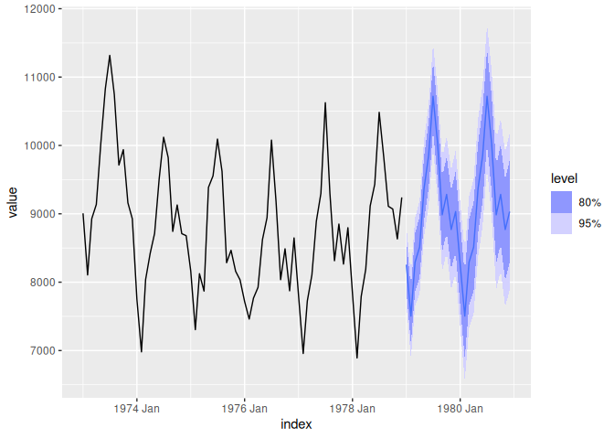
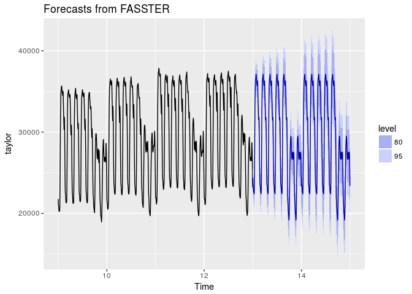

<!-- README.md is generated from README.Rmd. Please edit that file -->
fasster 
=======================================================

[](https://travis-ci.org/mitchelloharawild/fasster) 
[](https://www.tidyverse.org/lifecycle/#experimental)
<!-- [](https://cran.r-project.org/package=fasster) --> <!-- [](https://cran.r-project.org/package=fasster) -->

An implementation of the FASSTER (Forecasting with Additive Switching of Seasonality, Trend and Exogenous Regressors) model in R. This model is designed to capture patterns of multiple seasonality in a state space framework by using state switching. The *fasster* package prioritizes flexibility, computational speed and accuracy to provide convenient tools for modelling, predicting and understanding high frequency time-series.

Development cycle
-----------------

This package is early in development, and there are plans to make substantial changes in the future. These changes will be make to support a consistent modelling interface with the [fable](https://github.com/tidyverts/fable) package. After the modelling and forecasting tools in fable have been developed, this package will be overhauled to support better heuristic optimisation techniques and sparse matrix algebra (removing the dlm package dependency) to make fasster even faster. Until then, using this package may prove difficult due to limited support and documentation. These improvements are expected to be introduced within a few months.

Installation
------------

<!-- The **stable** version can be installed from CRAN: -->
<!-- ```{r, eval = FALSE} -->
<!-- install.packages("fasster") -->
<!-- ``` -->
The **development** version can be installed from GitHub using:

``` r
# install.packages("devtools")
devtools::install_github("tidyverts/fasster")
```

Usage
-----

### Model specification

*fasster* allows flexible model specification by allowing the user to specify the model structure with standard formula conventions.

``` r
fit <- tsibbledata::UKLungDeaths %>%
  FASSTER(fdeaths ~ mdeaths)

fit %>% summary
#> FASSTER Model:
#>  fdeaths ~ mdeaths 
#> 
#> Estimated variances:
#>  State noise variances (W):
#>   mdeaths
#>    1.7119e-34
#> 
#>  Observation noise variance (V):
#>   1.6631e+03
```

Commonly used state space components can be added using the following convenience functions:

-   `poly(n)` to include an n-th order polynomial
-   `seas(s)` to include a seasonal factor of frequency s
-   `trig(s, q)` to include seasonal fourier terms of frequency s with q harmonics
-   `arma(ar, ma)` to include an ARMA term (where ar and ma are vectors of coefficients)
-   Exogenous regressors can be added by referring to their name

For example, to create a model with trend and monthly seasonality, you can use:

``` r
fit <- USAccDeaths %>% 
  as_tsibble %>% 
  FASSTER(value ~ poly(1) + trig(12))
fit %>% summary
#> FASSTER Model:
#>  value ~ poly(1) + trig(12) 
#> 
#> Estimated variances:
#>  State noise variances (W):
#>   poly(1)
#>    5.9382e+03
#>   trig(12)
#>    8.7014e-13 4.3753e-13 6.1525e-13 1.0068e-13 4.0775e-13 2.3503e-13 3.1338e-13 2.2672e-13 2.7455e-13 2.5930e-13 1.0622e-13
#> 
#>  Observation noise variance (V):
#>   2.0543e+04
```

The interface for creating a FASSTER model introduces a new formula construct, `%S%`, known as the switch operator. This allows modelling of more complex patterns such as multiple seasonality by modelling the components for each group seperately and switching between them.

``` r
taylor_elec <- tsibble(
  DateTime = seq(ymd_h("2000-6-5 00"), by="30 mins", length.out=length(taylor)),
  Demand = as.numeric(taylor),
  index = DateTime
)

daytype <- function(date){
  factor(ifelse(wday(date) %in% 2:6, "Weekday", "Weekend"), levels = c("Weekday", "Weekend"))
}

taylor_elec
#> # A tsibble: 4,032 x 2 [30MINUTE]
#>    DateTime            Demand
#>    <dttm>               <dbl>
#>  1 2000-06-05 00:00:00  22262
#>  2 2000-06-05 00:30:00  21756
#>  3 2000-06-05 01:00:00  22247
#>  4 2000-06-05 01:30:00  22759
#>  5 2000-06-05 02:00:00  22549
#>  6 2000-06-05 02:30:00  22313
#>  7 2000-06-05 03:00:00  22128
#>  8 2000-06-05 03:30:00  21860
#>  9 2000-06-05 04:00:00  21751
#> 10 2000-06-05 04:30:00  21336
#> # ... with 4,022 more rows

fit_switch <- taylor_elec %>% 
  FASSTER(Demand ~ daytype(DateTime) %S% (poly(1) + trig(48, 10))) 

fit_switch %>%
  summary
#> FASSTER Model:
#>  Demand ~ daytype(DateTime) %S% (poly(1) + trig(48, 10)) 
#> 
#> Estimated variances:
#>  State noise variances (W):
#>   daytype(DateTime)_Weekday/poly(1)
#>    5.7652e+03
#>   daytype(DateTime)_Weekday/trig(48, 10)
#>    6.5698e-12 1.5176e-12 1.1341e-12 3.2066e-12 3.4680e-12 3.1447e-12 4.2754e-12 1.6076e-12 2.7693e-12 7.1102e-12 5.8313e-12 4.2100e-12 6.1504e-12 3.2553e-12 8.8292e-12 2.9127e-12 2.3115e-13 1.6822e-12 7.3759e-14 9.3947e-14
#>   daytype(DateTime)_Weekend/poly(1)
#>    4.4123e+03
#>   daytype(DateTime)_Weekend/trig(48, 10)
#>    2.4202e-12 3.7508e-12 2.2852e-12 2.8860e-12 2.6970e-12 3.2288e-12 4.3776e-12 3.8600e-12 3.1407e-12 3.5108e-12 2.1401e-12 3.3010e-12 2.9730e-12 2.4259e-12 3.8126e-12 1.7369e-12 8.2713e-13 1.3342e-12 1.0338e-12 1.1450e-12
#> 
#>  Observation noise variance (V):
#>   4.0715e+04
```

### Decomposing

Fitted FASSTER models can be decomposed to provide a description of how the underlying states function. Decomposing a FASSTER model provides aggregates of its components such as trends and seasonalities.

These components can accessed from a fitted model using the `components()` function:

``` r
fit %>% 
  components
#> # A tsibble: 72 x 3 [1MONTH]
#>       index `poly(1)` `trig(12)`
#>       <mth>     <dbl>      <dbl>
#>  1 1973 Jan     9740.     -795. 
#>  2 1973 Feb     9754.    -1546. 
#>  3 1973 Mar     9719.     -758. 
#>  4 1973 Apr     9706.     -536. 
#>  5 1973 May     9693.      322. 
#>  6 1973 Jun     9694.      802. 
#>  7 1973 Jul     9830.     1669. 
#>  8 1973 Aug     9755.      974. 
#>  9 1973 Sep     9761.      -65.7
#> 10 1973 Oct     9768.      233. 
#> # ... with 62 more rows
```

``` r
fit_switch %>%
  components
#> # A tsibble: 4,032 x 5 [30MINUTE]
#>    index               `daytype(DateTim… `daytype(DateTi… `daytype(DateTi…
#>    <dttm>                          <dbl>            <dbl>            <dbl>
#>  1 2000-06-05 00:00:00            29411.           -6626.           27511.
#>  2 2000-06-05 00:30:00            29346.           -7387.           27510.
#>  3 2000-06-05 01:00:00            29304.           -7567.           27510.
#>  4 2000-06-05 01:30:00            29436.           -7567.           27511.
#>  5 2000-06-05 02:00:00            29691.           -7736.           27513.
#>  6 2000-06-05 02:30:00            29869.           -8088.           27515.
#>  7 2000-06-05 03:00:00            30032.           -8379.           27516.
#>  8 2000-06-05 03:30:00            30179.           -8461.           27517.
#>  9 2000-06-05 04:00:00            30223.           -8476.           27518.
#> 10 2000-06-05 04:30:00            30224.           -8596.           27518.
#> # ... with 4,022 more rows, and 1 more variable:
#> #   `daytype(DateTime)_Weekend/trig(48, 10)` <dbl>
```

The tools made available by *fasster* are designed to integrate seamlessly with the tidyverse of packages, enabling familiar data manipulation and visualisation capabilities.

### Forecasting

*fasster* conforms to the object structure from the *forecast* package, allowing common visualisation and analysis tools to be applied on FASSTER models.

``` r
library(fable)
#> Loading required package: tsibblestats
#> 
#> Attaching package: 'tsibblestats'
#> The following object is masked from 'package:forecast':
#> 
#>     autolayer
#> 
#> Attaching package: 'fable'
#> The following objects are masked from 'package:forecast':
#> 
#>     autolayer, geom_forecast, GeomForecast, StatForecast

# fit %>% accuracy
# Currently not implemented

fit %>% 
  forecast(h=24) %>%
  autoplot
```



Future index values are automatically produced and used where necessary in the model specification.

``` r
fit_switch %>% 
  forecast(h = 48*7*2) %>% 
  autoplot
```


